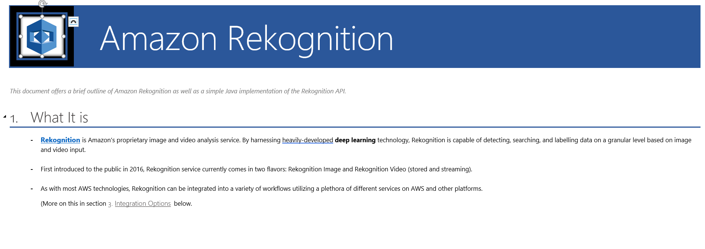
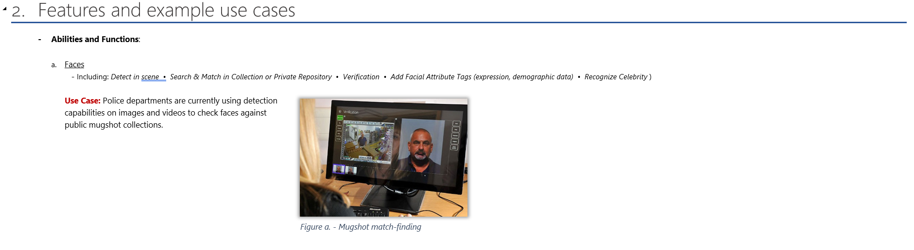
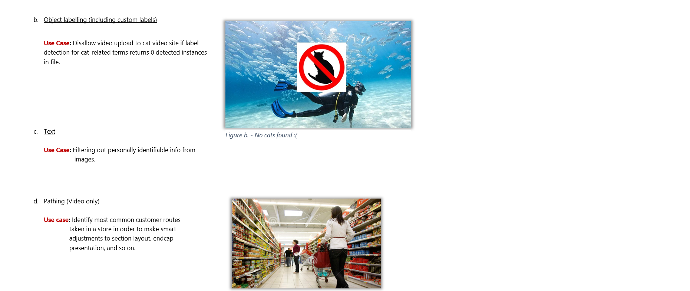
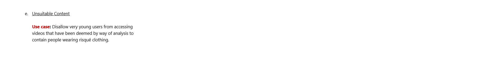
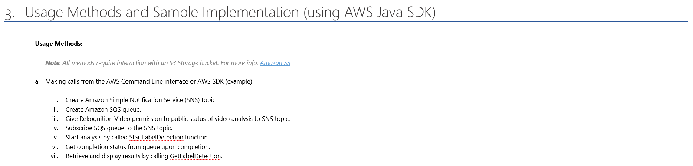
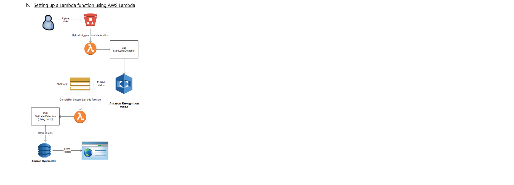
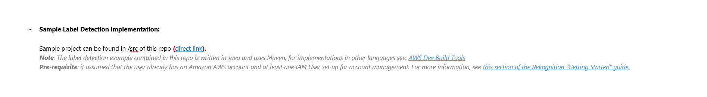
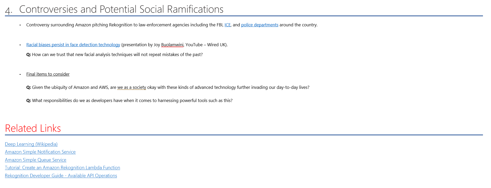

##### **Note: Due to Word formatting issues, original presentation doc has been presented here as images. Blue underlined links that are no longer clickable are referenced at the bottom of this page.

---

---
All links referenced in document above:

Section 1: 
- [About Rekognition](https://aws.amazon.com/rekognition/)

Section 3: 
- [Amazon S3](https://aws.amazon.com/s3/)
- [Sample project link](https://github.com/zcmarcus/RekognitionTest/blob/master/src/main/java/org/zcmarcus/VideoLabelDetection.java)
- [AWS Dev Build Tools](https://aws.amazon.com/tools/)
- [Getting Started with Rekognition - Step 1: Setup](https://docs.aws.amazon.com/rekognition/latest/dg/setting-up.html)

Section 4: 
- [Controversies: ICE](https://www.washingtonpost.com/news/the-switch/wp/2018/06/22/amazon-employees-demand-company-cut-ties-with-ice/)
- [Controversies: Police Departments](https://www.oregonlive.com/washingtoncounty/2019/05/amazons-facial-recognition-technology-is-supercharging-washington-county-police.html)
- [The Fight Against Bias [in code]](https://www.youtube.com/watch?v=N-Lxw5rcfZg)

Related Links:
- [Deep Learning (Wikipedia)](https://en.wikipedia.org/wiki/Deep_learning)
- [Amazon Simple Queue Service](https://aws.amazon.com/sqs/)
- [Amazon Simple Notification Service](https://aws.amazon.com/sns/)
- [Tutorial: Create an Amazon Rekognition Lambda Function](https://docs.aws.amazon.com/rekognition/latest/dg/stored-video-lambda.html)
- [Rekognition Developer Guide - Available API Operations](https://docs.aws.amazon.com/rekognition/latest/dg/API_Operations.html)
